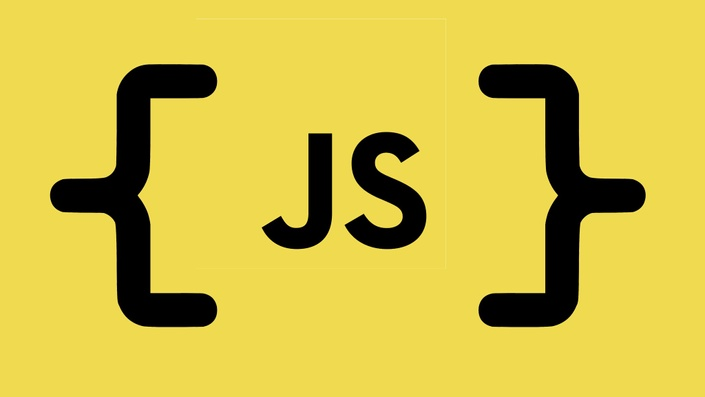
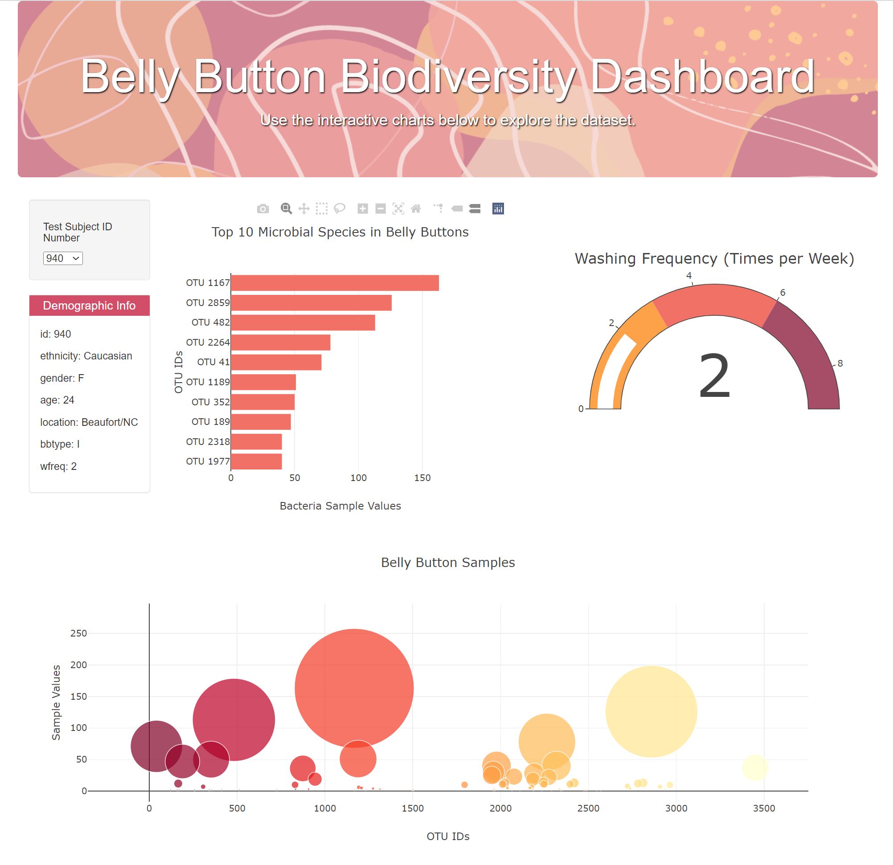

# Belly_Button_Biodiversity

Belly Button Biodiversity Dashboard is an open-source interactive dashboard that visualizes the Belly Button Biodiversity dataset. Built with JavaScript, D3.js, Plotly.js, HTML, and CSS, the dashboard features a dropdown menu, horizontal bar chart, bubble chart, demographic information display, and optional gauge chart.

### Belly Button Biodeversity Dashboard

Hi, let's show the Belly Button Biodiversity data in the form of highly interactive and dynamic webpage using Plotly.js

### 1 Introduction 

The Belly Button Biodiversity dataset reveals that a small handful of microbial species (also called operational taxonomic units or OTUs) are present in more than 70% of people, while the rest are relatively rare. This project creates an interactive dashboard to explore this dataset and visualize the top 10 OTUs found in each individual.

This is interactive web-based dashboard to explore and visualize the Belly Button Biodiversity dataset, which catalogs the microbes found in human navels.

### 2 Prerequisites

Before you begin, ensure you have the following installed:

HTML, CSS ( for structure and style web page)

JavaScript ( for dynamic behavior)

D3.js ( for data manipulation)

Plotly ( for interactive graphs )

### 3 Data Source

We get the data from the [Belly Button Biodiversity Dataset](https://2u-data-curriculum-team.s3.amazonaws.com/dataviz-classroom/v1.1/14-Interactive-Web-Visualizations/02-Homework/samples.json)

### 4 Features

Dropdown menu to select an individual sample.

Horizontal bar chart displaying the top 10 OTUs for the selected individual.

Bubble chart displaying all samples for the selected individual.

Display of the selected individual's demographic information.

Automatically updates all visualizations when a new sample is selected.

Gauge chart displaying the weekly washing frequency of the selected individual

### 5 Functions with D3.js and Plotly.js

We created some functions for the app.js and call them wherever required. The purpose of each function are:

To create the Dashboard activities for grab the data for updates in demmographic information and build charts.

To populate demographic information in an HTML element based on the selected patient ID.

To handle changes in the selected patient ID. When a new patient ID is selected, it logs the ID to the console, and then it calls other functions.

To get the data and build the 'Bar', 'Bubble', and 'Guage' charts.

### 6 Dashboard Layout

### 7 Usage

Select an individual sample from the dropdown menu to explore its data. The dashboard will automatically update the visualizations with the selected sample's data.

